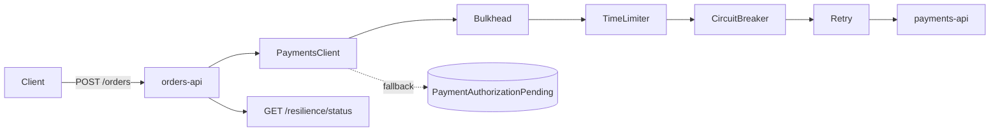

# microservice-resilience

Dois microsserviços em Spring Boot 3.5 (Java 21) onde o `orders-api` **sobrevive** ao `payments-api` lento ou quebrado, usando o pacote completo de resiliência do Resilience4j: timeout, retry com backoff e jitter, circuit breaker, bulkhead e fallback.

## Problema

`orders-api` chama `payments-api` para autorizar o pagamento. O pagamento começa a ficar lento ou a falhar. Sem proteção, o que acontece é sempre a mesma sequência:

1. Cada request de pedido fica preso esperando a resposta que não vem.
2. As threads do servidor acumulam, presas em I/O.
3. O pool de conexões esgota.
4. Rotas que **nem usam pagamento** começam a falhar.

Uma dependência degradada derruba o serviço inteiro. O objetivo aqui é conter a falha na fronteira da chamada remota.

## Stack

- Java 21
- Spring Boot 3.5.16
- Resilience4j 2.3.0 (`resilience4j-spring-boot3`)
- Spring `RestClient` sobre o JDK `HttpClient`
- Micrometer + Actuator (health, metrics, prometheus)
- JUnit 5, WireMock 3, AssertJ
- Docker Compose

## Arquitetura



O `PaymentsClient` é o **único** ponto do `orders-api` que fala com o pagamento — e por isso é o único lugar que precisa conhecer as políticas. O `OrderService` recebe um de três resultados (`Authorized`, `Declined`, `Unavailable`) e não sabe o que é timeout, retry ou circuito aberto. É o que mantém a regra de negócio legível apesar de cinco políticas no caminho.

## As cinco políticas

Todas configuradas em `orders-api/src/main/resources/application.yml`, na instância nomeada `payments`. Nenhum threshold vive no código Java.

| Política | Valor | Por quê |
| --- | --- | --- |
| **TimeLimiter** | 1.5s | O objetivo não é esperar o pagamento responder, é liberar a thread do `orders-api` rápido. |
| **Retry** | 2 tentativas, backoff exponencial 200ms ×2, jitter 0.5 | 2 tentativas no total, não 2 extras. Retry generoso amplifica o incidente: cada cliente vira N clientes em cima de quem já caiu. O jitter evita que todas as instâncias retentem no mesmo instante. |
| **CircuitBreaker** | janela 20, mínimo 10 chamadas, 50% de falha, 15s aberto, 3 chamadas em half-open | Não decide nada antes de ter amostra. Abrir na primeira falha isolada é pior do que não ter circuit breaker. |
| **Bulkhead** | 8 chamadas simultâneas, espera 0 | Teto de concorrência: impede que uma dependência lenta consuma todas as threads. Espera zero de propósito — rejeitar na hora é melhor do que virar mais uma fila invisível. |
| **Fallback** | pedido `PAYMENT_PENDING` + fila | Resposta controlada (202), nunca 500 genérico. |

### Ordem dos aspectos (importa muito)

O Resilience4j aplica os aspectos nesta ordem fixa:

```
Retry ( CircuitBreaker ( TimeLimiter ( Bulkhead ( chamada ) ) ) )
```

Três consequências que o projeto assume de propósito:

1. **Cada retry conta como uma chamada no circuit breaker.** O circuito abre mais rápido sob falha — que é o comportamento desejado.
2. **Com o circuito aberto, o retry tentaria repetir `CallNotPermittedException`.** Por isso o retry ignora explicitamente `CallNotPermittedException` e `BulkheadFullException`: não adianta insistir numa porta que foi fechada de propósito.
3. **O `fallbackMethod` fica no `@Retry`**, o aspecto mais externo. Se estivesse no `@CircuitBreaker`, o fallback devolveria um valor de sucesso antes do retry enxergar a falha, e o retry nunca retentaria.

### Timeout é por tentativa, não por request

No modo `slow`, o pagamento demora 5s e o TimeLimiter corta em 1.5s — mas o request total leva ~3.3s, porque são 2 tentativas mais o backoff. **O pior caso de um request é `maxAttempts × timeout + backoff`**, não `timeout`. Se o seu SLA é 2s, ou o timeout cai ou o retry sai.

### Recusa não é indisponibilidade

`REJECTED` e `PAYMENT_PENDING` são coisas diferentes:

- **`Declined` (422)** — o pagamento está saudável e disse "não". Volta como valor normal: o circuit breaker registra **sucesso**, o retry não insiste, e o pedido vira `REJECTED` sem ir para a fila. Reprocessar algo que já foi negado não muda o resultado.
- **`Unavailable`** — nem deu para perguntar. O circuito conta como falha e o pedido vira `PAYMENT_PENDING`.

Confundir os dois faz o circuit breaker abrir por motivo errado e enche a fila de trabalho que nunca vai dar certo.

### Circuito aberto não deixa o serviço DOWN

`allow-health-indicator-to-fail: false`. Com o circuito aberto o `orders-api` está saudável e fazendo exatamente o que deveria: degradando de forma controlada. Marcar `DOWN` faria o orquestrador reiniciar ou tirar do balanceador um serviço que está funcionando.

## Serviços e endpoints

### orders-api (8080)

```
POST /orders               201 PAID | 201 REJECTED | 202 PAYMENT_PENDING
GET  /orders/{id}          200 | 404
GET  /orders/pending       fila de autorizações pendentes
GET  /resilience/status    estado do circuito, bulkhead e fila
GET  /actuator/health      inclui o health indicator do circuit breaker
GET  /actuator/prometheus  métricas do Resilience4j
```

### payments-api (8081)

```
POST /payments/authorize        200 | 422 | 500, conforme o modo ativo
GET  /payments/mode             modo atual
POST /payments/mode/success     200 OK imediato
POST /payments/mode/slow        demora 5s e responde 200
POST /payments/mode/fail        500 sempre
POST /payments/mode/flaky       500 em 50% das chamadas
POST /payments/mode/declined    422 (recusa de negócio)
GET  /actuator/health
```

## Como rodar

### Docker Compose (recomendado)

```bash
docker compose up --build
```

O `orders-api` só sobe depois do `payments-api` ficar `healthy`.

### Maven

> Esta máquina tem `JAVA_HOME` global apontando para o JDK 25, que o Spring Boot 3.x não aceita. Rode com o JDK 21:

```bash
JAVA_HOME="F:\graalvm-jdk-21.0.8+12.1" mvn test        # suíte completa
JAVA_HOME="F:\graalvm-jdk-21.0.8+12.1" mvn -pl payments-api spring-boot:run
JAVA_HOME="F:\graalvm-jdk-21.0.8+12.1" mvn -pl orders-api  spring-boot:run
```

## Roteiro de demonstração

As saídas abaixo são reais, capturadas da stack rodando em Docker Compose.

### 1. Modo `success` → pedido `PAID`

```bash
curl -X POST http://localhost:8080/orders \
  -H "Content-Type: application/json" \
  -H "X-Correlation-Id: demo-1" \
  -d '{"customerId":"c-1","amount":99.90}'
```

```json
{"id":"9dab782b-...","status":"PAID","amount":99.90,"authorizationId":"auth-a300eb38-...","reason":null}
```

```
HTTP 201 em 0.499s
```

### 2. Modo `slow` → timeout corta a chamada

```bash
curl -X POST http://localhost:8081/payments/mode/slow
curl -X POST http://localhost:8080/orders -H "Content-Type: application/json" \
  -d '{"customerId":"c-1","amount":99.90}'
```

```json
{"id":"592c670a-...","status":"PAYMENT_PENDING","amount":99.90,"authorizationId":null,"reason":"timeout na chamada ao pagamento"}
```

```
HTTP 202 em 3.293s
```

O pagamento demora 5s. O request voltou em 3.3s (2 tentativas × 1.5s + backoff) e **não ficou preso**.

### 3. Modo `fail` → o circuito abre

```bash
curl -X POST http://localhost:8081/payments/mode/fail
for i in $(seq 1 6); do
  curl -s -o /dev/null -w "%{http_code}" -X POST http://localhost:8080/orders \
    -H "Content-Type: application/json" -d '{"customerId":"c-1","amount":10.00}'
  curl -s http://localhost:8080/resilience/status
done
```

```
pedido 1 -> HTTP 202 | circuito: CLOSED
pedido 2 -> HTTP 202 | circuito: CLOSED
pedido 3 -> HTTP 202 | circuito: CLOSED
pedido 4 -> HTTP 202 | circuito: OPEN
pedido 5 -> HTTP 202 | circuito: OPEN
pedido 6 -> HTTP 202 | circuito: OPEN
```

Repare: **o cliente nunca recebeu 500.** Todos os pedidos viraram `202 PAYMENT_PENDING`.

### 4. O estado das políticas

```bash
curl http://localhost:8080/resilience/status
```

```json
{
  "circuitBreakerState": "OPEN",
  "failureRatePercentage": 90.0,
  "bufferedCalls": 10,
  "successfulCalls": 1,
  "failedCalls": 9,
  "notPermittedCalls": 3,
  "bulkheadAvailableConcurrentCalls": 8,
  "bulkheadMaxConcurrentCalls": 8,
  "pendingQueueSize": 7
}
```

### 5. Com o circuito `OPEN`, o `payments-api` nem é chamado

```bash
antes=$(docker compose logs payments-api | grep -c "autorizando pedido")
curl -X POST http://localhost:8080/orders -H "Content-Type: application/json" \
  -d '{"customerId":"c-1","amount":10.00}'
depois=$(docker compose logs payments-api | grep -c "autorizando pedido")
```

```
resposta em 0.023s
chamadas recebidas pelo payments-api: antes=10 depois=10
```

**Esse é o ponto inteiro do circuit breaker:** 23 milissegundos em vez de 3.3 segundos, e o contador do `payments-api` não se moveu. Enquanto o circuito está aberto, a dependência quebrada recebe zero carga extra e tem chance de se recuperar.

### 6. Recuperação: `OPEN` → `HALF_OPEN` → `CLOSED`

```bash
curl -X POST http://localhost:8081/payments/mode/success
# esperar os 15s de wait-duration-in-open-state
```

```
circuito: HALF_OPEN
pedido de teste 1 -> HTTP 201 | circuito: HALF_OPEN
pedido de teste 2 -> HTTP 201 | circuito: HALF_OPEN
pedido de teste 3 -> HTTP 201 | circuito: CLOSED
```

Três chamadas de teste bem-sucedidas (`permitted-number-of-calls-in-half-open-state: 3`) e o circuito fecha sozinho.

### 7. A fila de pendentes

```bash
curl http://localhost:8080/orders/pending
```

```json
[
  {"orderId":"592c670a-...","amount":99.90,"reason":"timeout na chamada ao pagamento","enqueuedAt":"2026-08-20T17:18:34.050898440Z"},
  {"orderId":"30ad0d3f-...","amount":10.00,"reason":"falha ao chamar o pagamento: payments-api respondeu 500","enqueuedAt":"..."}
]
```

### 8. Logs correlacionados entre os dois serviços

```bash
docker compose logs orders-api   | grep demo-1
docker compose logs payments-api | grep demo-1
```

```
orders-api    | INFO [orders-api,demo-1]   ... pedido 9dab782b-... criado com status PAID
payments-api  | INFO [payments-api,demo-1] ... autorizando pedido 9dab782b-... no modo SUCCESS
```

O `X-Correlation-Id` atravessa o filtro HTTP, o **pool de threads** do cliente (via `MdcPropagatingExecutor`) e o header da chamada remota. Sem propagar o MDC pelo pool, os logs mais interessantes de um incidente — os do retry, do timeout e do fallback — sairiam sem rastro nenhum.

### 9. Métricas para dashboard e alerta

```bash
curl -s http://localhost:8080/actuator/prometheus | grep '^resilience4j_circuitbreaker_state'
```

```
resilience4j_circuitbreaker_state{name="payments",state="closed"} 1.0
resilience4j_circuitbreaker_state{name="payments",state="open"} 0.0
resilience4j_circuitbreaker_state{name="payments",state="half_open"} 0.0
```

São 31 séries do Resilience4j no endpoint (estado, taxa de falha, latência das chamadas, permits do bulkhead, tentativas de retry). `resilience4j_circuitbreaker_state{state="open"} == 1` é o alerta que importa: significa que uma dependência caiu e o serviço já está degradando de propósito.

## Testes

```bash
JAVA_HOME="F:\graalvm-jdk-21.0.8+12.1" mvn test
```

52 testes (14 no `payments-api`, 38 no `orders-api`). Os que carregam o peso do projeto:

| Teste | O que prova |
| --- | --- |
| `deveAbrirOCircuitoAposFalhasSeguidas` | 500 repetido leva o circuito a `OPEN` |
| `naoDeveChamarPagamentoComCircuitoAberto` | com `OPEN`, o WireMock recebe **zero** requisições |
| `halfOpenDevePermitirChamadasDeTeste` | `HALF_OPEN` deixa passar chamada de sondagem |
| `deveVoltarParaClosedDepoisDaRecuperacao` | 3 sucessos em `HALF_OPEN` fecham o circuito |
| `deveVoltarParaOpenSeAFalhaPersistirNoHalfOpen` | falha em `HALF_OPEN` reabre |
| `bulkheadDeveRejeitarChamadasAlemDoLimiteSimultaneo` | 12 chamadas concorrentes contra limite 8 |
| `modoSlowDeveCriarPedidoPendenteSemPrenderORequest` | 202 em menos de 5s, com a fila alimentada |
| `naoDeveTratarRecusaLegitimaComoIndisponibilidade` | 422 não conta como falha no circuito |
| `devePropagarOCorrelationIdParaOPagamento` | MDC sobrevive à troca de thread |

O perfil `test` reduz os números (janela 10, mínimo 5 chamadas) e dispara as transições de estado pelo registry em vez de dormir esperando o timer. Testar o relógio do Resilience4j com `sleep` produz teste lento e intermitente, e o que estaria sendo verificado seria a biblioteca, não o nosso código. O tempo real de 15s aparece no roteiro acima.

## Tradeoffs

| Decisão | + | − |
| --- | --- | --- |
| **Retry sozinho** | Simples, resolve falha transitória | Amplifica o incidente: mais carga em cima de quem já caiu |
| **Circuit breaker** | Para de insistir numa dependência quebrada | Threshold mal calibrado abre cedo demais e derruba tráfego saudável |
| **Bulkhead** | Isola a falha, protege o pool de threads | Rejeita chamadas legítimas sob carga alta |
| **Fallback** | Experiência controlada, nunca 500 genérico | Cria dívida: alguém precisa processar a fila depois |
| **Retry por fora do CB** (padrão do Resilience4j) | Circuito abre mais rápido sob falha real | Uma falha lógica conta como N no circuito; infla a taxa |
| **Fila em memória** | Zero infraestrutura, foco na política | Some no restart; produção pediria broker ou outbox |
| **`CompletableFuture` + `RestClient`** | `@TimeLimiter` e `@Bulkhead` viram instâncias nomeadas e observáveis | Cancelar o future **não** interrompe o I/O bloqueante; a thread só é liberada no read timeout (3s) |

O último merece atenção: o `TimeLimiter` libera **o request do cliente** em 1.5s, mas a thread do pool que faz a chamada só é devolvida quando o `RestClient` desiste. É por isso que o read timeout (3s) existe e é maior que o TimeLimiter — e é por isso que o `bulkhead` precisa ser dimensionado pensando no read timeout, não no TimeLimiter. Esse detalhe aparece nos testes: o teste de saturação do bulkhead precisa esperar os permits voltarem antes do próximo teste rodar.

## O que ficou de fora, e por quê

- **`inventory-api` e `gateway-api`** — opcionais no enunciado. Um par de serviços já expõe todo o problema de resiliência; um terceiro só repetiria o mesmo código.
- **Rate limit** — citado no pacote de produção, mas é proteção de **entrada** (protege quem recebe). O problema deste projeto é proteção de **saída**: proteger quem chama de uma dependência ruim. São defesas para problemas diferentes.
- **Broker real e consumidor da fila** — o ponto do projeto é a política de resiliência, não a infraestrutura de mensageria. O que importa é que o fallback deixe o trabalho registrado em vez de perder o pedido.
- **Persistência** — pedidos vivem em `ConcurrentHashMap`.
